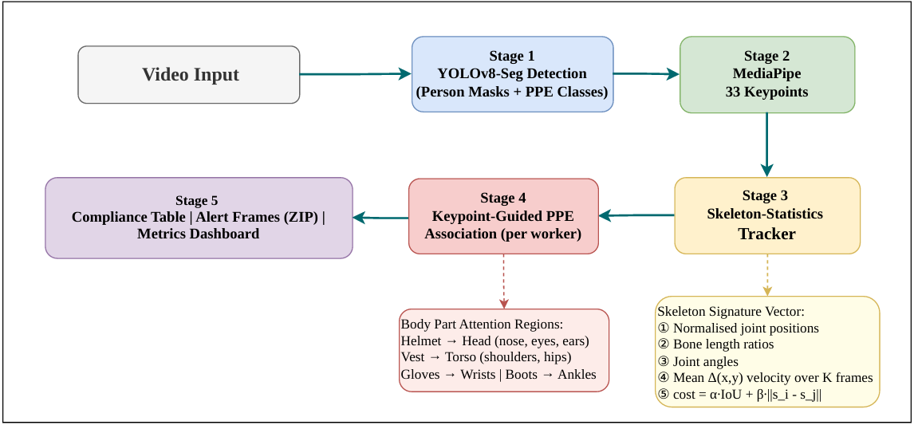

# 👷‍♂️ PPE Compliance Detection System

A real-time **Personal Protective Equipment (PPE) compliance detection system** that monitors construction workers in video feeds for safety equipment adherence. Built with a custom **SkeletonStat-Track** pipeline combining YOLO11x detection, pose estimation, and skeleton-statistics-guided tracking.



---

## 🎯 Problem Statement

Build a computer vision system that:
- **Detects** persons and PPE items (helmets, vests, gloves, goggles, boots) from video frames
- **Tracks** workers persistently across frames to maintain identity
- **Associates** PPE items to the correct worker using spatial reasoning
- **Flags** missing PPE and exports alert frames with bounding boxes and confidence scores
- **Displays** results in a Streamlit UI with downloadable compliance table and ZIP export

---

## 🏗️ Pipeline Architecture

### Stage 1 — YOLO11x Detection
A fine-tuned `YOLO11x` model trained on the [Ultralytics Construction-PPE dataset](https://docs.ultralytics.com/datasets/detect/construction-ppe/) detects persons and 5 PPE classes with bounding boxes and confidence scores.

### Stage 2 — Pose Estimation (YOLO11x-Pose)
Extracts **17 COCO keypoints** per detected person. These keypoints drive both the skeleton tracker (Stage 3) and the PPE-to-person association (Stage 4).

### Stage 3 — Skeleton-Statistics Tracker
A custom **Hungarian-matching tracker** that maintains persistent identity using a multi-signal cost function:

```
cost(i, j) = α · (1 − IoU) + β · ‖center_dist‖ + γ · ‖skeleton_features‖
```

The **skeleton signature vector** includes:
1. **Normalised joint positions** — translated to mid-hip origin, scaled by torso height
2. **Bone length ratios** — e.g., upper-arm/torso, lower-leg/torso (stable per individual)
3. **Joint angles** — at knees, elbows, hips, shoulders (encodes posture)
4. **Short-term motion statistics** — mean Δ(x,y) velocity over last K frames

This approach is robust to occlusion and worker crossings since body proportions remain discriminative even when appearance fails.

### Stage 4 — Keypoint-Guided PPE Association
Each PPE detection is assigned to the spatially closest worker by checking proximity of the PPE bounding box center to body-part attention regions derived from keypoints:

| PPE Item | Anchor Keypoints | Body Region |
|---|---|---|
| Helmet | Nose, Eyes, Ears | Head bounding region |
| Goggles | Left Eye, Right Eye | Eye-region box |
| Vest | Shoulders, Hips | Torso bounding region |
| Gloves | Left Wrist, Right Wrist | Wrist-extended region |
| Boots | Left Ankle, Right Ankle | Ankle-extended region |

### Stage 5 — Compliance Logic & Dashboard
For each tracked person, the set difference between expected and detected PPE constitutes the violation. Results are surfaced in a **Streamlit dashboard** with:
- Live annotated video feed with PPE bounding boxes and confidence scores
- Per-frame compliance table with CSV download
- ZIP export of alert frames (violation frames with full annotations)
- Evaluation metrics dashboard

---

## 📊 Model Performance

### Per-Class Detection (Positive Classes)

| Class | Instances | mAP50 |
|---|---|---|
| Person | 239 | 88.3% |
| Vest | 171 | 86.7% |
| Boots | 151 | 83.8% |
| Goggles | 47 | 82.4% |
| Helmet | 201 | 82.1% |
| Gloves | 136 | 80.0% |

### Aggregate Metrics (Positive Classes)

| Metric | Value |
|---|---|
| mAP50 | 83.9% |
| Precision | 80.2% |
| Recall | 79.9% |
| F1 Score | 80.0% |

> **Note:** Overall metrics (including negative classes like `no_helmet`, `no_boots`) are lower due to severe class imbalance. Our pipeline intentionally ignores negative classes and uses logic-based violation detection instead.

---

## 📁 Project Structure

```
.
├── app.py                          # Streamlit Dashboard (Stage 5)
├── pipeline.py                     # Core Pipeline (Stages 1–4)
├── requirements.txt                # Python dependencies
├── index.html                      # Portfolio landing page
├── PPE.Pipeline.png                # Architecture diagram
│
├── YOLO/                           # Detection training
│   ├── train.py                    # YOLO11x training script (lab GPU)
│   ├── infer.py                    # Standalone inference script
│   └── data.yaml                   # Dataset config (11 classes)
│
├── Tracking people/                # Stage 3: Skeleton Tracker
│   ├── tracker.py                  # SkeletonTracker + Track classes
│   ├── skeleton_features.py        # Feature extractor (bone ratios, angles)
│   ├── config.py                   # Hyperparameters & ablation modes
│   └── main.py                     # Standalone tracking runner
│
├── from_lab/                       # Lab GPU outputs
│   ├── runs/.../weights/best.pt    # Trained YOLO11x model weights
│   └── PPE_systech_Test file.mp4   # Test video
│
└── outputs/                        # Pipeline outputs
    └── annotated_video_*.mp4       # Annotated output videos
```

---

## 🚀 Quick Start

### Prerequisites
- Python 3.9+
- pip

### Installation

```bash
git clone https://github.com/rashiniyasp/PPE-Compliance-Detection-System.git
cd PPE-Compliance-Detection-System
pip install -r requirements.txt
```

### Run the Dashboard

```bash
streamlit run app.py
```

Then open [Streamlit Dashboard](https://rashi26ppe.streamlit.app) in your browser.


### Usage
1. Upload a test video or check "Use Default Test Video"
2. Click **Run Pipeline**
3. Watch the live annotated feed with PPE bounding boxes and confidence scores
4. Download the compliance CSV or alert frames ZIP after inference completes
   
> ⚠️ **Note:** Here used large YOLO models may exceed free-tier memory limits and may be Very Slow. 

---

## 🔧 Training (Requires GPU)

To retrain the YOLO11x detection model:

```bash
cd YOLO
python train.py
```

This trains on the Construction-PPE dataset for 100 epochs with AutoBatch.

---

## 🛠️ Tech Stack

| Component | Technology |
|---|---|
| Detection | YOLO11x (Ultralytics) |
| Pose Estimation | YOLO11x-Pose |
| Tracking | Custom SkeletonTracker (SciPy Hungarian) |
| UI | Streamlit |
| Video Processing | OpenCV |
| Data | Pandas, NumPy |

---

## 📄 License

This project uses the [Ultralytics AGPL-3.0 License](https://ultralytics.com/license) for YOLO components.

---
